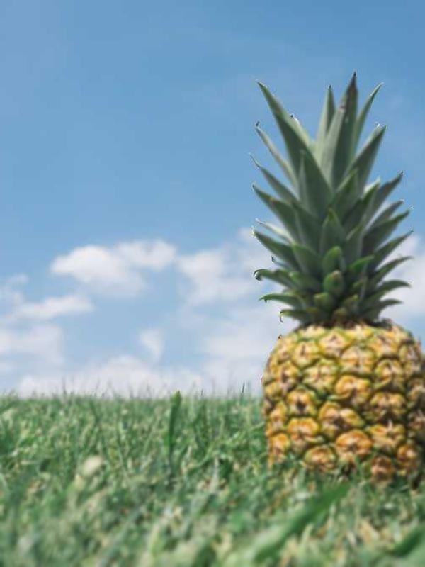
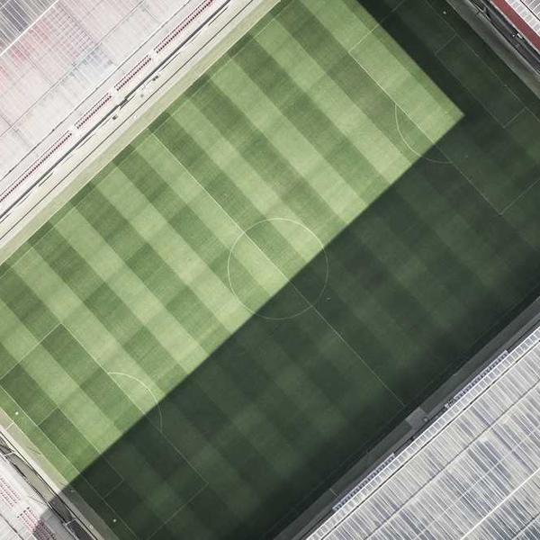
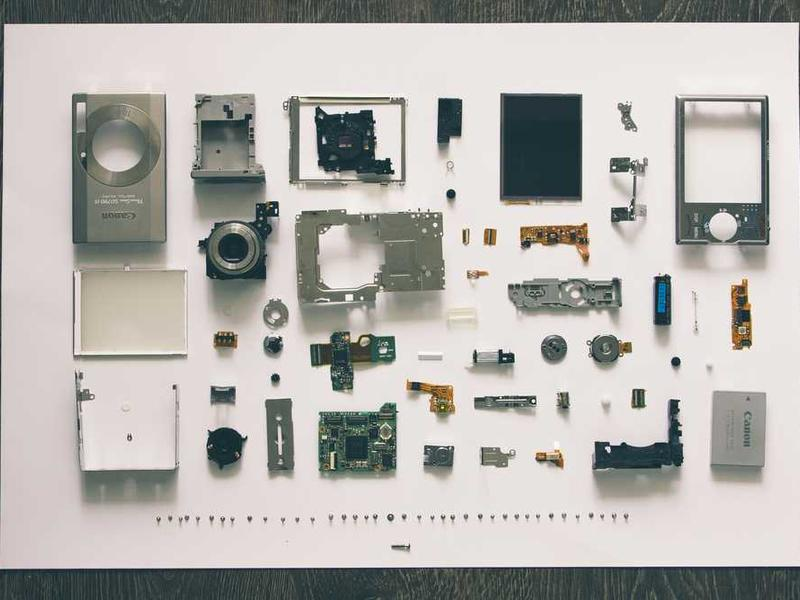
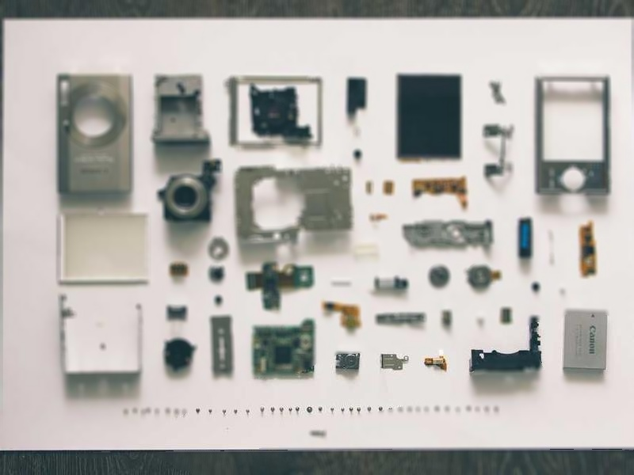

# ⌬ Zer0-Day Bokeh ⌬

*Your vision, sharpened.*

A command-line utility, forged in the neon-drenched alleys of the net, to manipulate the depth of field of your images. This script uses the MiDaS intelligence to construct a depth map and applies a customizable, high-quality bokeh effect. Dial in the perfect blur, from creamy circular bokeh to razor-sharp polygonal apertures.

---

## ► C Y B E R W A R E _ I N S T A L L A T I O N

Clone this repository and uplink the necessary neural dependencies.

```bash
# Install system dependencies
pip install -r requirements.txt
```

---

## ► O P E R A T I O N

Execute the script from your terminal. Point it at an input image and configure the parameters to your specifications. The processed image will be saved to the `output/` directory by default.

**Syntax:**
```bash
python dof_bokeh.py --input <path_to_image> [OPTIONS]
```

**Example Operations:**

1.  **Octagonal Bokeh on a Street Scene:**
    ```bash
    python dof_bokeh.py --input examples/street.jpg --blades 8 --focus 0.72 --max_radius 20
    ```

2.  **Circular Bokeh on a Portrait (Click-to-Focus):**
    A preview window will appear. Click on the subject to set the focal point, then press any key to generate the image.
    ```bash
    python dof_bokeh.py --input examples/portrait.jpg --blades 0 --preview
    ```

3.  **Hexagonal Bokeh on a Product Shot (Auto-Focus):**
    ```bash
    python dof_bokeh.py --input examples/product.jpg --blades 6 --angle 15 --focus_percentile 0.6
    ```

---

## ► G A L L E R Y

*A glimpse into the abyss...*

| Original | Zer0-Day Bokeh Applied |
| :---: | :---: |
|  |  |
| *Portrait with circular bokeh* |
|  |  |
| *Product shot with hexagonal bokeh* |
|  |  |
| *Street scene with octagonal bokeh* |

---

## ► P A R A M E T E R S

- `--input`: Path to the input image. (Required)
- `--outdir`: Directory to save the output image. (Default: `output`)
- `--blades`: Number of aperture blades for bokeh shape. 0 creates a perfect circle. (Default: 8)
- `--angle`: Rotation angle for polygonal bokeh.
- `--max_radius`: Maximum blur radius. Controls the intensity of the DoF effect. (Default: 28)
- `--sharpness`: Controls the sharpness of the transition between in-focus and out-of-focus areas. (Default: 12)
- `--preview`: Enable interactive click-to-focus preview window.
- `--focus_percentile`: Automatically set focus based on a percentile of the depth map (e.g., 0.6 focuses on the foreground).
- `--focus`: Manually set a normalized focus depth from 0.0 (closest) to 1.0 (farthest).
